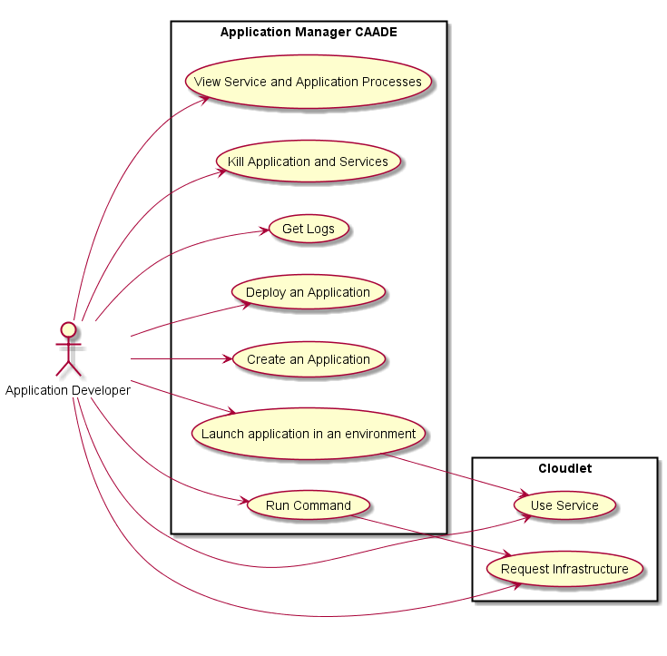

# Application Developer
The Application Developer develops cloud aware applications. This is the same actor
as in the [CAADE Architecture](https://github.com/CAADE/Caade/blob/master/design/README.md).

Click here to see the base Use Cases and [Application Developer Specification](https://github.com/CAADE/Caade/blob/master/design/Actors/ApplicationDeveloper/README.md)

## Use Cases

* [Use Service](Use%20Service/README.md)
* [Request Infrastructure](RequestInfrastructure/README.md)

## User Interface

TBD

## Command Line Interface

TBD
