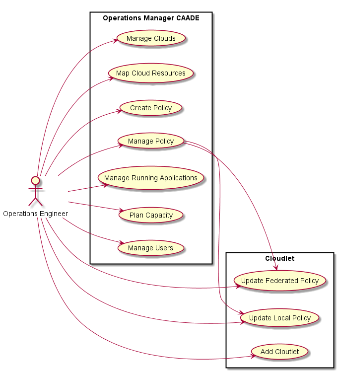

# Operations Manager
The Operation Manager is responsible for managing the operations of the system.
This includes the creation and management of environments, users, and connectivity to the Clouds.

This is the same Operations Manager as defined in the [CAADE Architecture](https://github.com/CAADE/Caade/blob/master/design/README.md)
Click here to see the base [Operation Manager Specification](https://github.com/CAADE/Caade/blob/master/design/Actors/OperationsManager/README.md)

## Use Cases

* [Add Cloudlet](Add%20Cloudlet/README.md)
* [Update Local Policies](Update%20Local%20Policies/README.md)
* [Update Federated Policies](Update%20Federated%20Policies/README.md)

## User Interface
TBD

## Command Line Interface
TBD
