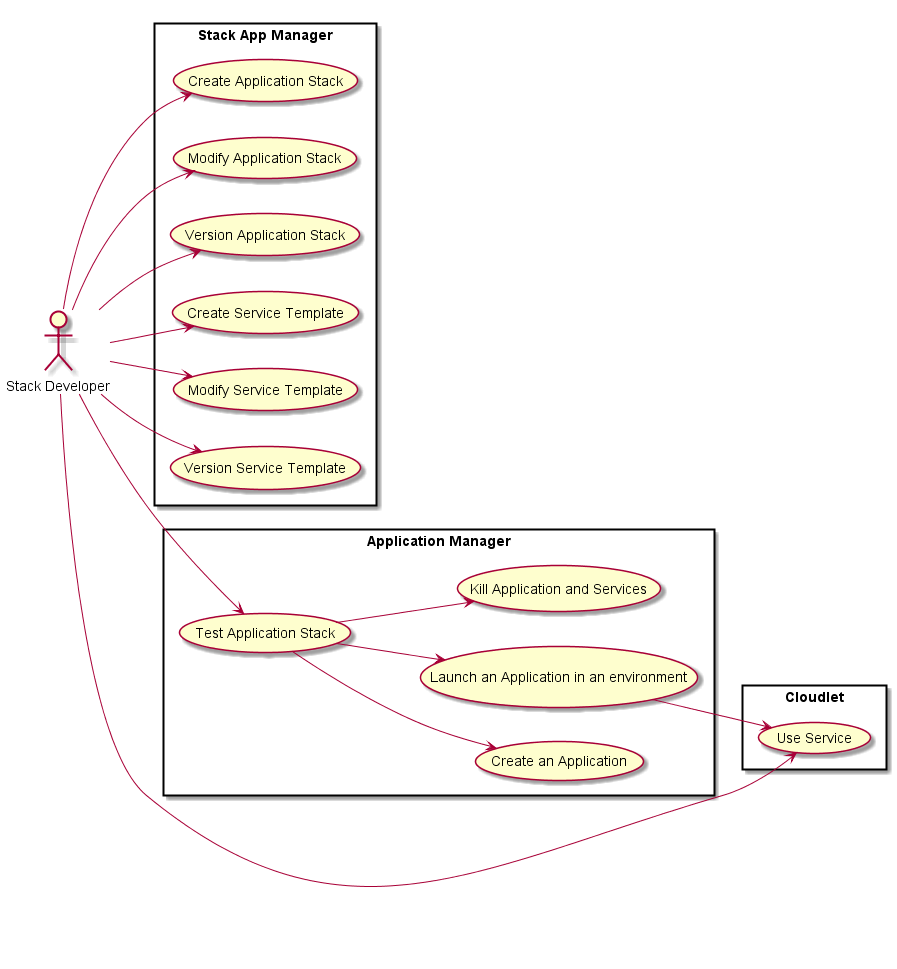

# Stack Developer
The Stack Developer is responsible for developing Application Stacks and Service Templates
This includes developing the configurations of services and applications for multiple environments and clouds.

This is the same Stack Developer in the [CAADE Architecture](https://github.com/CAADE/Caade/blob/master/design/README.md).
Click here for the [Stack Developer Specification](https://github.com/CAADE/Caade/blob/master/design/Actors/StackDeveloper/README.md).

## Use Cases 

* Register Service

## User Interface

TBD

## Command Line Interface

TBD

