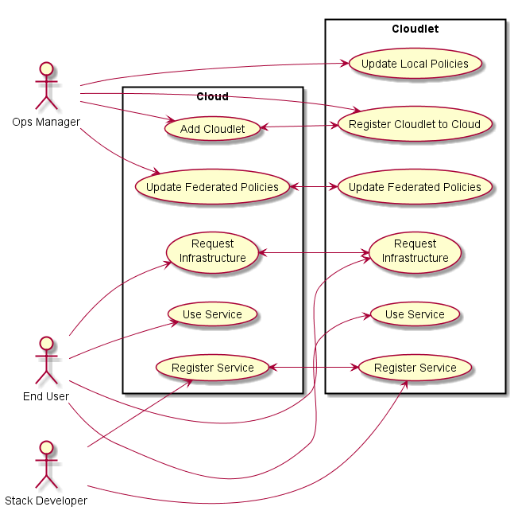
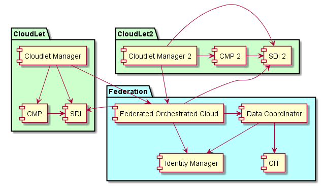
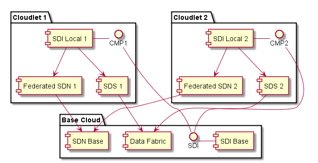

# Cloudlet Architectural Overview

Cloudlets represent an architecture of federated cloud that have a CMP+Automation+PaaS+CloudOS bundle as described
in the [CAADE](https://github.com/CAADE/Caade/blob/master/design/README.md) architecture. The architecture targets cloud operations
managers and should be as transparent to the end user and developer as possible.

## [Users](Actors/README.md)

 * [Application Developer](Actors/ApplicationDeveloper/README.md)
 * [Stack Developer](Actors/OperationsManager/README.md)
 * [Operations Engineer](Actors/StackDeveloper/README.md)

## High level Use Cases

* [Register Cloudlet to Cloud](Scenarios/Add Cloudlet/README.md) - Register a Cloudlet to Cloud helps setup the federation of clouds.
* [Update Local Policies](Scenarios/Update%20Local%20Policies/README.md) - update policies that only apply to the local cloud not the whole federation.
* [Update Federated Policies](Scenarios/Update%20Federated%20Policies/README.md) - update policies that propigate to all or part of the clouds in the federation
* [Use Service](Scenarios/Use%20Service/README.md) - Use a service in the federation. This could use a service in the local or one of the remote clouds.
* [Register Service](Scenarios/Register%20Service/README.md) - Register a service in the cloud federation.
* [Request Infrastructure](Scenarios/Request%20Infrastructure/README.md) - Request Infrastructure (Compute, Storage, or network) in the cloud federation.

## High Level Architecture

The Cloudlet Architecture contains a small set of services that establishes a federation of cloud by standardizing on a
common CMP layer from the [CAADE](https://github.com/CAADE/Caade/blob/master/design/README.md) architecture. Each Cloud will
a CloudletManager Service running that will help establish the federations between the clouds. Coordination between the
Clouds in the Federation will be handled by a set of services that give the federation connectivity.

* [Cloudlet Manager](Systems/Cloudlet%20Manager/README.md) -  Each Cloud Has a Cloudlet manager that becomes part of the Federation
* [Federated Orchestrated Cloud](Systems/Federated%20Orchestrated%20Cloud/README.md) - Federated Orchestrated to schedule service requests acrosss multiple clouds
* [Data Coordinator](Systems/Data%20Coordinator/README.md) - Coordinates data between Clouds
* [Identity Management](Identity%20Management/README.md) - Manages Identity across multiple clouds
* [CIT](Systems/CIT/README.md) - Manages Securee keys in TPMs across multiple data centers.

## Deployment model

The goal of the architecture is to connect multiple clouds together that are scattered across an organization.
This could be physically as well as logically. There is the concept of a base Cloud that could offer multiple
clouds and remote clouds named cloudlets.

## Trusted Cloudlets

Trusted Cloudlets give the ability to set up a trusted federation of cloud and to segment that federation 
with geo fencing technology using CIT.

In this example Each cloud has a geo fenced data set that can be shared with other clouds but not all of the clouds.

