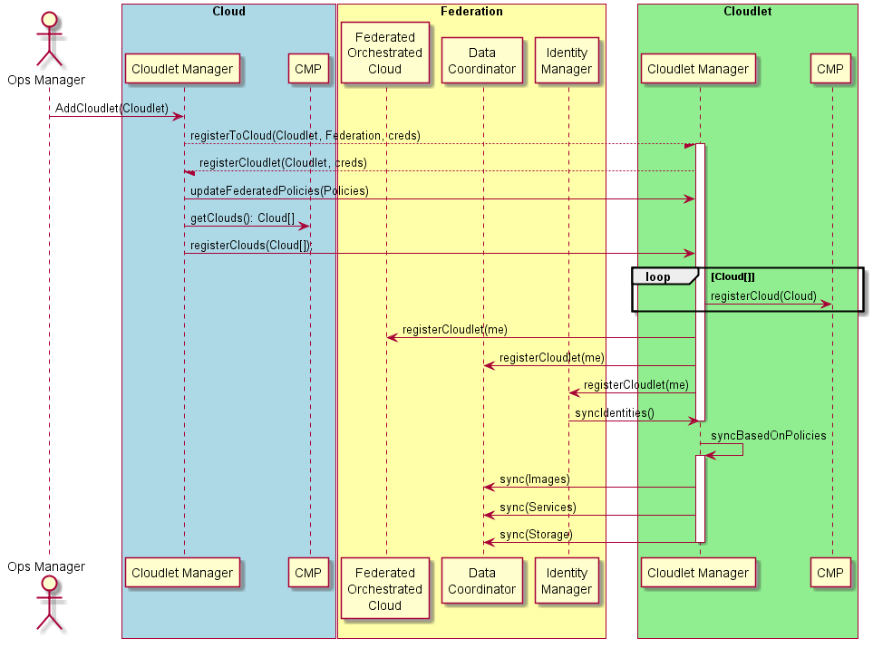

# Add Cloudlet to Cloud

## Actor
* [Ops Manager](../Actors/OperationsManager/README.md)

## Scenario
Operations Manger adds a new "Cloudlet" to the Cloud Federations. This allows a remote site Cloud 
"Cloudlet" to now access all of the resources in the Cloud Federation for the users at th remote site.
The goal is that the Self Service Portal appears to be the same at all of the sites and the use
of multiple clouds is transparent to the end user.

## Systems Invovled
* [Cloudlet Manager](../Systems/Cloudlet Manager/README.md)
* [CMP - Cloud Management Platform](../Systems/CMP/README.md)
* [Federated Orchestrated Cloud](../Systems/Federated Orchestrated Cloud/README.md)
* [Data Coordinator](../Systems/Data Coordinator/README.md)
* [Identity Manager](../Systems/Identity Manager/README.md)
