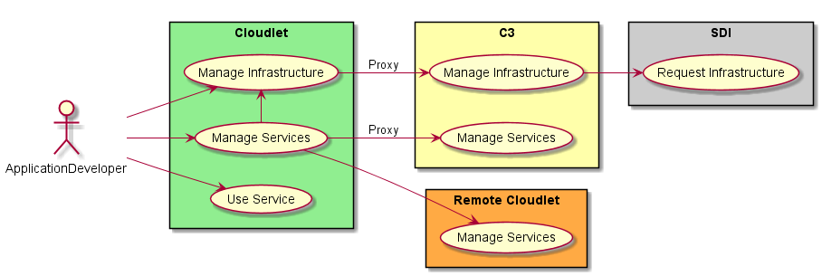
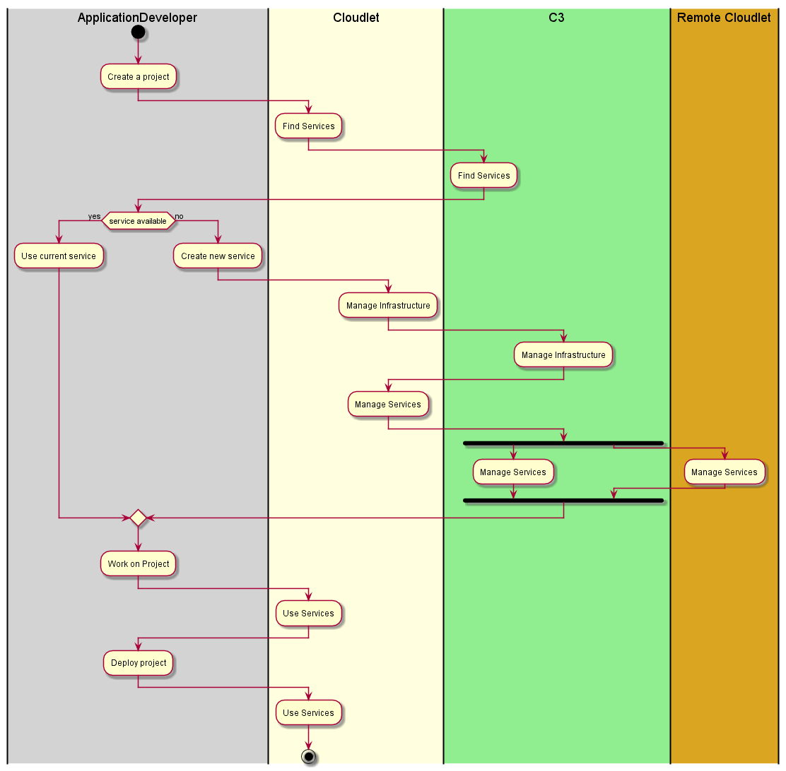

.. _Actor-Application-Developer:

Application Developer
=====================

The Application Developer develops cloud aware applications. This is the same actor
as in the `C3 Architecture <http://c3.readthedocs.io/en/latest/Actors/ApplicationDeveloper/Actor-ApplicationDeveloper.html>`_.

Use Cases
---------

* :ref:`UseCase-Use-Service`
* :ref:`UseCase-Manage-Services`

Activities
----------

Application Develoer will typically use existing services as well as develop new services.
In order to use existing services they can look up the services or service stacks in the Cloudlet
service registry either locally or globally. One the service or service stacks is selected. It
can be used by the Application Developer to developer their application.

If the service or service stack cannot be found then the Application Developer can create a new service in the
cloudlet federation. They first need to request infrastructure to build the new service.
Then they build the service and then add it to the cloudlet federation. The service could be
local or global in the federation.

Workflow
--------

Propagation of activities to the underlying C3 architecture is normal mode of operation.

User Interface
--------------

TBD

Command Line Interface
----------------------

TBD

