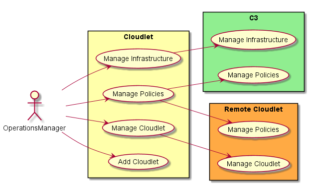

.. _Operations-Manager:

Actor Operations Manager
========================

The Operation Manager is responsible for managing the operations of the system.
This includes the creation and management of environments, users, and connectivity to the Clouds.

This is the same Operations Manager as defined in the `CAADE Architecture <https://c3.readthedocs.io>`_.
Click here to see the base `Operation Manager Specification <http://c3.readthedocs.io/en/latest/Actors/OperationsManager/Actor-OperationsManager.html>`_.

Use Cases
---------

* :ref:`UseCase-Manage-Cloudlet`
* :ref:`UseCase-ManageInfrastructure`
* :ref:`UseCase-ManagePolicies`

Activities
----------

The Operations Manager focuses on the management of the cloudlet federation and the establishment
of the federation through adding cloudlets to the federation, adding policies to the federation,
managing infrastructure and managing the cloudlets.

Workflow
--------

Before the Cloudlet can be used the Cloudlet service needs to be installed for the C3 instance.
Once it has been installed the cloudlet is registered with other cloudlets to form the federation.
Once the federation has been formed the Operations Managaer can perform day to day operations,
such as managing infrastructure and policies.

User Interface
--------------

TBD

Command Line Interface
----------------------

TBD

