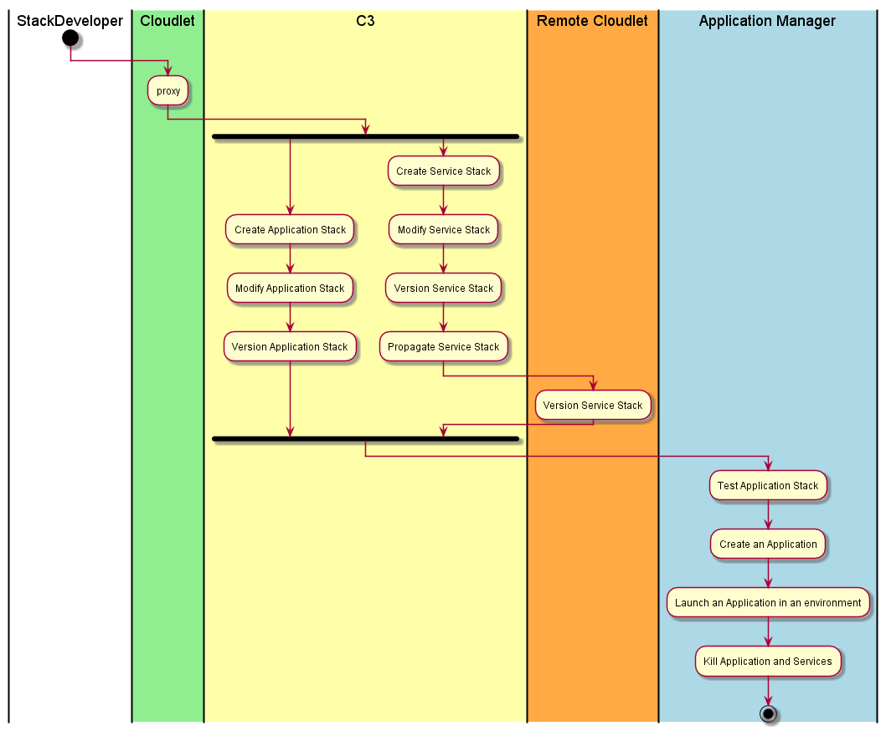

.. _Actor-Stack-Developer:

Actor Stack Developer
=====================

The Stack Developer is responsible for developing Application Stacks and Service Templates
This includes developing the configurations of services and applications for multiple environments and clouds.

This is the same Operations Manager as defined in the `CAADE Architecture <https://c3.readthedocs.io>`_.
Click here to see the base `Operation Manager Specification <http://c3.readthedocs.io/en/latest/Actors/StackDeveloper/Actor-StackDeveloper.html>`_.

Use Cases
---------

* :ref:`UseCase-Manage-Services`
* :ref:`UseCase-Use-Service`

Activities
----------

All activities by the stack developer are proxies to the C3 Architecture.
The Stack Developer is not a primary user of the Cloudlet. It is basically a passthru
layer that allows the connection and then propigation of services and stacks to all of the
Clouds in the cloudlet.

Workflow
--------

As the stack developer makes changes to services and application stacks those changes are propagated to
remote cloudlets or to a centralized repository that all remote cloudlets can access.

User Interface
--------------

TBD

Command Line Interface
----------------------

TBD

