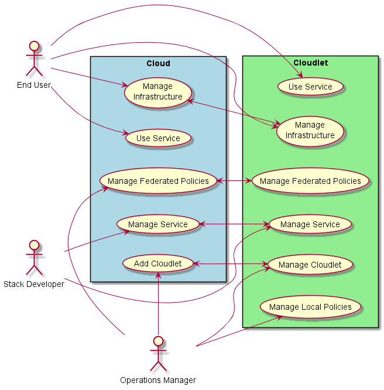
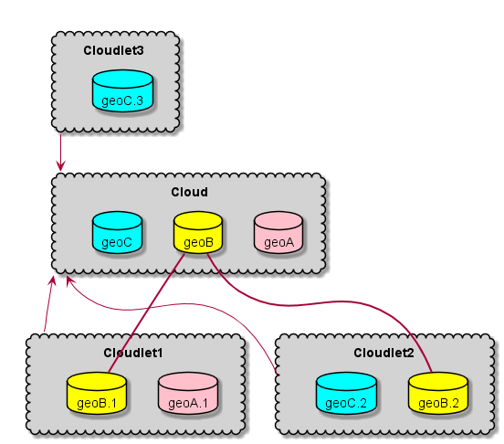
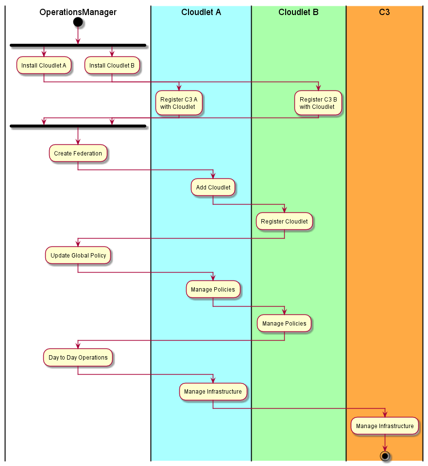
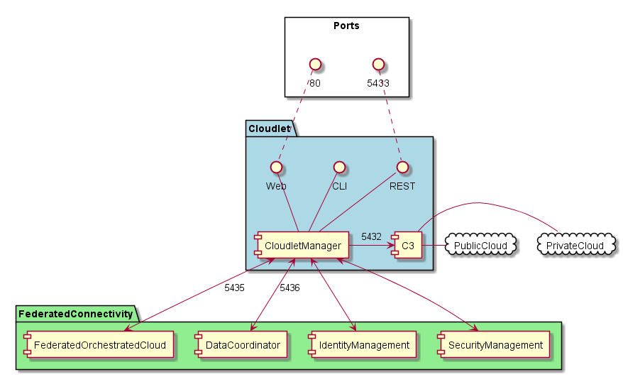
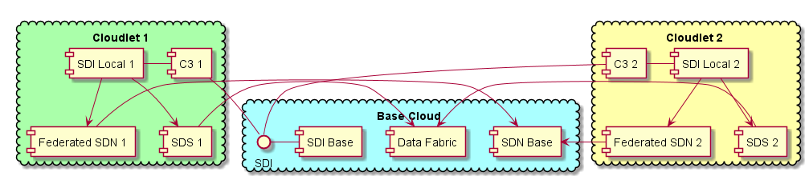

.. _Home:

Cloudlet Overview
=================

.. _C3: http://c3.readthedocs.io

The Cloudlet Architecture enables the connection of multiple data centers, devices, remote locations or edge devices
to be managed and utilized as one cloud ecosystem. The architecture describes the Use Cases, Actors, and subsystems
that define the cloudlet architecture. The C3_ architecture is used as the base to the Cloudlet architecture.

High Level Use Case
-------------------

* :ref:`UseCase-Manage-Cloudlet` - Manage Cloudlets to Cloud helps setup the federation of clouds.
* :ref:`UseCase-Manage-Policies` - Manage policies that apply to the federation and to specific clouds or data centers
* :ref:`UseCase-Manage-Services` - Register a service in the cloud federation.
* :ref:`UseCase-Use-Service` - Use a service in the federation. This could use a service in the local or one of the remote clouds.

Users
-----

* :ref:`Actor-Application-Developer`
* :ref:`Actor-Operations-Manager`
* :ref:`Actor-Stack-Developer`

Logical Architecture
--------------------
The Cloudlet Architecture contains a small set of services that establishes a federation of cloud by standardizing
on a common CMP layer from the Hybrid Cloud architecture. Each cloud has a Cloudlet Manager Service running that
will help establish the federations between the clouds. Coordination between the Clouds in the Federation will be
handled by a set of services that give the federation connectivity, security and manageability. This same
architecture has been extended to Edge and Cloud connectivity in the cases that an edge device includes the
minimal “micro” cloud architecture. The C3_ architecture is the base to this architecture.

* :ref:`SubSystem-Trust-Manager` - Manages Securee keys in TPMs across multiple data centers.
* :ref:`SubSystem-Cloudlet-Manager` - Each Cloud Has a Cloudlet manager that becomes part of the Federation
* :ref:`SubSystem-Data-Coordinator` - Coordinates data between Clouds
* :ref:`SubSystem-Federated-Orchestrated-Cloud` - Federated Orchestrated to schedule service requests acrosss multiple clouds
* :ref:`SubSystem-Identity-Manager` - Manages Identity across multiple clouds
* :ref:`SubSystem-Telemetry` - Aggregates Telemetry before sharing the telemetry to the other cloudlets.
* C3_ - This is a common hybrid cloud architecture that must be present in each cloud. The key elements that must be there are a Cloud management platform, an automation framework, and a platform as a service framework. This a requirement of the architecture not part of the architecture.

Process Architecture
--------------------

There are several activities that an Operations Manager performs with the Cloudlet Architecture including: Setting up
the federation of clouds to form cloudlets, Establishing Local and Global (Federated Policies), Creating Secure
geo-fenced domains, and updating and patching infrastructure across the cloudlets.

Deployment model
----------------

The Cloudlet architecture should be as light weight as possible and should integrate existing infrastructure and
systems with minimal impact on the current system. Existing cloud installations are used to handle the heavy lifting
in the system. The cloudlet architecture requires a hybrid cloud architecture that includes Cloud Management
Platform, Automation Framework & Platform as a Service, or the functions defined in those sets of tools.

The Cloudlet Architecture has a :ref:`SubSystem-Cloudlet-Manager` is that placed as a connectivity layer between the hybrid cloud
and the Federated Connectivity. The connectivity gives all of the functionality that is needed to
federate the different clouds systems together. This let’slets the cloud operate independently from other cloud(s).
Allowing for them to operate in a disconnected or semi-connected state.

Trusted Cloudlets
-----------------

Setting up a cloudlet architecture does not mean they are secure or trusted. Trusted Cloudlets give the ability to set
up a trusted federation of cloud and to segment that federation with geo fencing technology using Intel CIT, TXT
and TPMs. Intel TXT and CIT technologies provide the trusted launch and attestation of the cloud workloads and
infrastructure. Overall trust and security in a cloud computing infrastructure must begin with the servers and base
compute systems. The basic elements of this trusted platform span hardware, firmware, and software to provide the
best balance of tamper-resistance and functionality.

In this example Each cloud has a geo fenced data set that can be shared with other clouds but not all of the clouds.

Physical Architecture
---------------------

The goal of the architecture is to connect multiple clouds together that are scattered across an organization.
This could be physically as well as logically. There is the concept of a base Cloud that could offer multiple
clouds and remote clouds named cloudlets.

