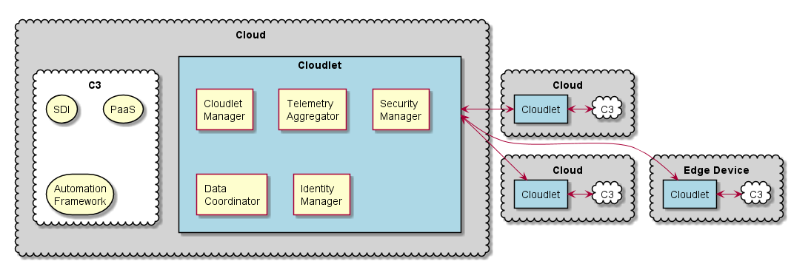
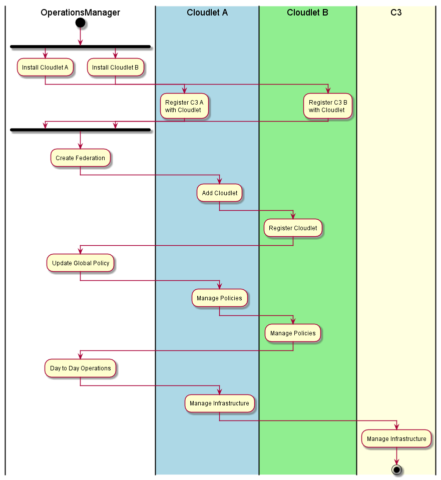

.. _Home:

Cloudlet Overview
=================

High Level Use Case
-------------------

* :ref:`UseCase-Manage-Cloudlet`
* :ref:`UseCase-Manage-Policies`
* :ref:`UseCase-Manage-Services`
* :ref:`UseCase-Use-Service`

.. image:: UseCases/UseCases.png

Users
-----

* :ref:`Actor-Application-Developer`
* :ref:`Actor-Operations-Manager`
* :ref:`Actor-Stack-Developer`

Logical Architecture
--------------------

* :ref:`SubSystem-Trust-Management`
* :ref:`SubSystem-Cloudlet-Manager`
* :ref:`SubSystem-Data-Coordinator`
* :ref:`SubSystem-Federated-Orchestrated-Cloud`
* :ref:`SubSystem-Identity-Manager`

Process Architecture
--------------------

Deployment model
----------------

Physical Architecture
---------------------

.. image:: Solution/Physical.png

