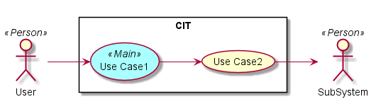
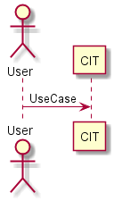
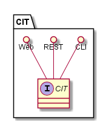
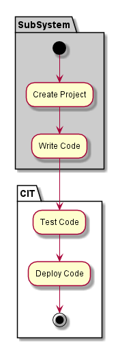
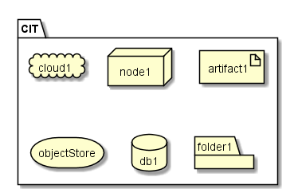
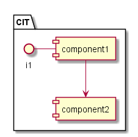

.. _SubSystem-CIT:

CIT
===

The CIT is responsible for the managing of secure keys in the TPM.

Use Cases
---------

*

Users
-----

* :ref:`Actor-User`

Uses
----

* :ref:`CIT`

Interface
---------

* CLI - Command Line Interface
* REST-API -
* Portal - Web Portal

Logical Artifacts
-----------------

*

Activities and Flows
--------------------

Deployment Architecture
-----------------------

Physical Architecture
---------------------

