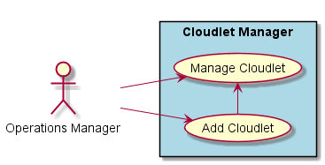
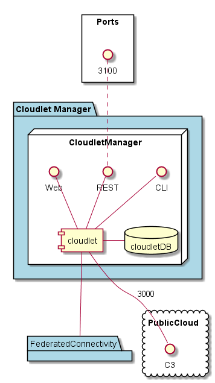
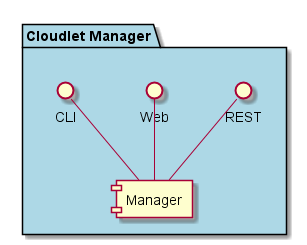

.. _SubSystem-Cloudlet-Manager:

Cloudlet Manager
================
The Cloudlet Manager is responsible for connecting a "Cloud" into the Cloud Federation.
Once the Cloud is connected to th Cloud Federation it will be known as a Cloudlet in that federation.

Use Cases
---------

*

Users
-----

* :ref:`Actor-Operations-Manager`

Uses
----

* :ref:`SubSystem-Cloudlet-Manager`

Interface
---------

* CLI - Command Line Interface
* REST-API -
* Portal - Web Portal

Logical Artifacts
-----------------

*

Activities and Flows
--------------------

Deployment Architecture
-----------------------

Physical Architecture
---------------------

