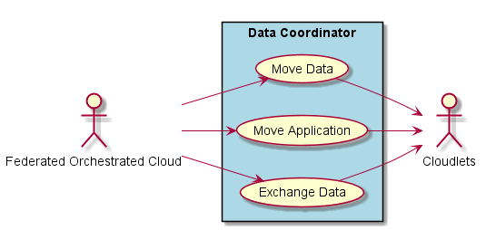

.. _SubSystem-Data-Coordinator:

Data Coordinator
================

Data Coordinator is a subsystem of Cloudlet architecture and is responsible for coordinating data between
the clouds. This is for data that can be moved between data centers based on policies and bandwidth capabilities.

Typical data that should be shared between Data Centers are

* Service Images
* Service Templates
* Application Templates
* Shared Policy Data
* Shared Registries
* Application Data

The Data Coordinator is responsible for creating secure domains between the multiple Cloudlets and moving data or
applications between the Cloudlets. It will work with the :ref:`SubSystem-Trust-Manager` to establish geofenced
federated secure domains that the data can freely move.

There are three modes that the Data Coordinator can use to move data or applications.
1. Data Movement - Move data between the Cloudlets
1. Data Exchange - Split and application into multiple services and distribute the services on the different cloudlets.
1. App Movement - Move an application to the Data.

Use Cases
---------

* Move Data
* Move Application
* Exchange Data

Users
-----

* :ref:`Actor-Operations-Manager`

.. image:: UserInteraction.png

Uses
----

* :ref:`SubSystem-Data-Coordinator`
* Cloudlet

Interface
---------

* CLI - Command Line Interface
* REST-API -
* Portal - Web Portal

Logical Artifacts
-----------------

* Data Mover - Moves data between trusted geofenced secure domains between the Cloudlets.
* Application Mover - Find the data required for the application and moves the application to the proper Cloudlet.
* Data Exchange - Create a results Agregator and sets up the Data Exchange Source micro-services in each Cloudlet.

.. image:: Logical.png

Activities and Flows
--------------------

.. image::  Process.png

Deployment Architecture
-----------------------

Physical Architecture
---------------------

.. image:: Physical.png

