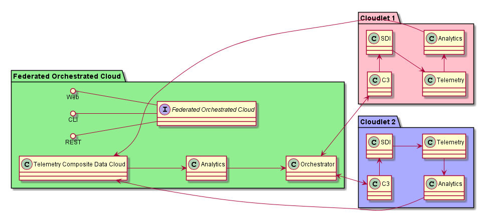
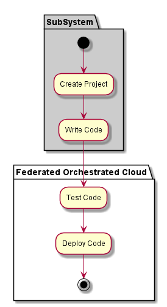
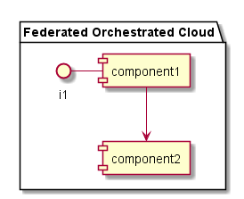

.. _SubSystem-Federated-Orchestrated-Cloud:

Federated Orchestrated Cloud
============================

Federated Orchestrated Cloud is a subsystem of the Cloudlet Architecture.
The Federated Orchestrated Cloud (FOC) is responsible for coordinating service requests between the clouds.
It has three major components. SNAP, Analytics and and Orchestrator.
The FOC should be the majority of the added integration required for the federation.

Use Cases
---------

*

Users
-----

* :ref:`Actor-User`

Uses
----

* :ref:`Federated-Orchestrated-Cloud`

Interface
---------

* CLI - Command Line Interface
* REST-API -
* Portal - Web Portal

Logical Artifacts
-----------------

  Information from the analytics.
  Would be used to determine what services should be on the cloud.
  It will also determine what pre-staged Images
  or VMs would be best on the Cloud.
  This information is dynamic.

  A cloud is responsible for itself. Other clouds cannot push
  jobs or services to a cloud. A Cloud pulls services/data/ etc..
  From other clouds and makes  the services available

  Policy will determine how often a Service will be removed
  from the Cloudlet and force other Cloudlets to use the Cloud.

Activities and Flows
--------------------

Deployment Architecture
-----------------------

Physical Architecture
---------------------

