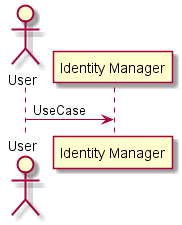

.. _SubSystem-Identity-Manager:

Identity Manager
================

The Identity Manager handles identity across multiple clouds.

Use Cases
---------

*

.. image:: UseCases.png

Users
-----

* :ref:`Actor-Operations-Manager`

Uses
----

* :ref:`SubSystem-Identity-Manager`

Interface
---------

* CLI - Command Line Interface
* REST-API -
* Portal - Web Portal

Logical Artifacts
-----------------

*

Activities and Flows
--------------------

Deployment Architecture
-----------------------

Physical Architecture
---------------------

