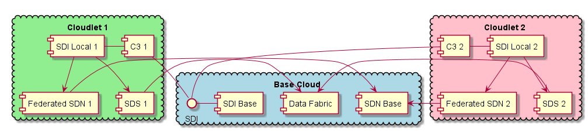

.. _Solution:

Solution Overview
=================

.. _C3: http://c3.readthedocs.io/

Cloudlets represent an architecture of federated cloud that have a CMP+Automation+PaaS+CloudOS bundle as described
in the C3_ architecture. The architecture targets cloud operations
managers and should be as transparent to the end user and developer as possible.

High Level Use Case
-------------------

* :ref:`UseCase-Manage-Cloudlet`
* :ref:`UseCase-Manage-Policies`
* :ref:`UseCase-Manage-Services`
* :ref:`UseCase-Use-Service`

.. image:: ../UseCases/UseCases.png

Users
-----

* :ref:`Actor-Application-Developer`
* :ref:`Actor-Operations-Manager`
* :ref:`Actor-Stack-Developer`

Logical Architecture
--------------------

What is the smallest size of the data for a cloudlet to:
Authenticate all users in the cloud federation
All other data required to run any job or at least start a job remotely.

This should help answer the storage requirements for the Cloudlet.

Where is data impacted:
1. Data Latency?
1. Does data Gravity have a big play
1. What VMs do you want localized
1. What images are required on the Remote Clouds
1. Updates to Cloudlets.

.. image:: Logical.png

* :ref:`SubSystem-Cloudlet-Manager` -  Each Cloud Has a Cloudlet manager that becomes part of the Federation
* :ref:`SubSystem-Federated-Orchestrated-Cloud` - Federated Orchestrated to schedule service requests acrosss multiple clouds
* :ref:`SubSystem-Data-Coordinator` - Coordinates data between Clouds
* :ref:`SubSystem-Identity-Manager` - Manages Identity across multiple clouds
* :ref:`SubSystem-Trust-Manager` - Manages Securee keys in TPMs across multiple data centers.
* :ref:`SubSystem-Telemtry` - Aggregates Telemetry before forwarding it own to a cloudlet telemetry
* C3_ - Common Cloud Core including a Cloud Management Platform

Process Architecture
--------------------

There are several activities that an Operations Manager performs with the Cloudlet Architecture including: Setting up
the federation of clouds to form cloudlets, Establishing Local and Global (Federated Policies), Creating Secure
geo-fenced domains, and updating and patching infrastructure across the cloudlets.

.. image:: Process.png

Deployment model
----------------

The Cloudlet architecture should be as light weight as possible and should integrate existing infrastructure and
systems with minimal impact on the current system. Existing cloud installations are used to handle the heavy lifting
in the system. The cloudlet architecture requires a hybrid cloud architecture that includes Cloud Management
Platform, Automation Framework & Platform as a Service, or the functions defined in those sets of tools.

The Cloudlet Architecture has a :ref:`SubSystem-Cloudlet-Manager` is that placed as a connectivity layer between the hybrid cloud
and the Federated Connectivity. The connectivity gives all of the functionality that is needed to
federate the different clouds systems together. This let’slets the cloud operate independently from other cloud(s).
Allowing for them to operate in a disconnected or semi-connected state.

.. image:: Deployment.png

Physical Architecture
---------------------

The goal of the architecture is to connect multiple clouds together that are scattered across an organization.
This could be physically as well as logically. There is the concept of a base Cloud that could offer multiple
clouds and remote clouds named cloudlets.

