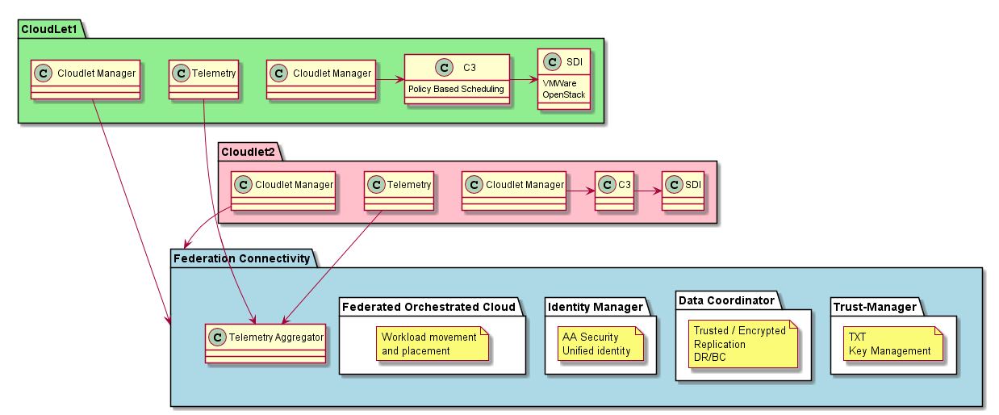

.. _Solution:

Solution Overview
=================
Cloudlets represent an architecture of federated cloud that have a CMP+Automation+PaaS+CloudOS bundle as described
in the `Common Cloud Core <https://c3.readthedocs.io>`_ architecture. The architecture targets cloud operations
managers and should be as transparent to the end user and developer as possible.

High Level Use Case
-------------------

* :ref:`UseCase-Manage-Cloudlet`
* :ref:`UseCase-Manage-Policies`
* :ref:`UseCase-Manage-Services`
* :ref:`UseCase-Use-Service`

.. image:: ../UseCases/UseCases.png

Users
-----

* :ref:`Actor-Application-Developer`
* :ref:`Actor-Operations-Manager`
* :ref:`Actor-Stack-Developer`

Logical Architecture
--------------------

What is the smallest size of the data for a cloudlet to:
Authenticate all users in the cloud federation
All other data required to run any job or at least start a job remotely.

This should help answer the storage requirements for the Cloudlet.

Where is data impacted:
1. Data Latency?
1. Does data Gravity have a big play
1. What VMs do you want localized
1. What images are required on the Remote Clouds
1. Updates to Cloudlets.

* :ref:`SubSystem-Cloudlet-Manager` -  Each Cloud Has a Cloudlet manager that becomes part of the Federation
* :ref:`SubSystem-Federated-Orchestrated-Cloud` - Federated Orchestrated to schedule service requests acrosss multiple clouds
* :ref:`SubSystem-Data-Coordinator` - Coordinates data between Clouds
* :ref:`SubSystem-Identity-Manager` - Manages Identity across multiple clouds
* :ref:`SubSystem-Trust-Management` - Manages Securee keys in TPMs across multiple data centers.
* `Hybrid Cloud <http://c3.readthedocs.io>`_ - Common Cloud Core including a Cloud Management Platform

Process Architecture
--------------------

.. image:: Process.png

Deployment model
----------------

.. image:: Deployment.png

Physical Architecture
---------------------

.. image:: Physical.png

