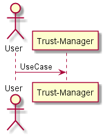
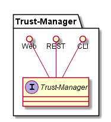
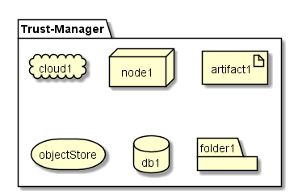
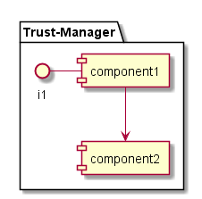

.. _SubSystem-Trust-Manager:

Trust Manager
=============

Setting up a cloudlet architecture does not mean they are secure or trusted. Trusted Cloudlets give the ability to
set up a trusted federation of cloud and to segment that federation with geo fencing technology using Intel CIT,
TXT and TPMs. Intel TXT and CIT technologies provide the trusted launch and attestation of the cloud workloads and
infrastructure. Overall trust and security in a cloud computing infrastructure must begin with the servers and base
compute systems. The basic elements of this trusted platform span hardware, firmware, and software to provide the
best balance of tamper-resistance and functionality.

Intel Trusted Execution Technology (TXT) is available with servers featuring the Intel® Xeon® processor E3, E5,
and E7 families. Platform-level enhancements provide the building blocks to enable visibility, trust,
and control in the cloud.

Intel TXT is a combination of hardware and software aimed at securing the execution of sensitive workloads. In
contrast to solutions that protect the Operating System, Intel TXT builds a chain of trust from the system
firmware all the way to the server or hypervisor to prevent attacks on system firmware or BIOS, MBR, boot
loader, OS and hypervisor. Every component in this chain is verified against known good states and, depending
on the result, marked either trusted or untrusted.

This approach allows detection of not only threats to the OS itself, such as viruses, but also attacks on the
configuration and even manipulation of the server’s boot firmware and hardware. When a breach is detected, workloads
that require secure execution cannot be executed on this server.

Designed to measure the execution environment and protect sensitive information from attacks, it operates with
Trusted Platform Module (TPM), an industry-standard device that can securely store artifacts used to verify
integrity of the platform Hardware-based root of trust—when coupled with an enabled operating system, hypervisor,
and solutions—is the foundation for a more secure computing platform that can ensure hypervisor and VMM integrity
at boot from rootkits or other low-level attacks. It establishes the trust-worthiness of the server and host
platforms. The hardware-based root of trust uses open industry standards developed by Trusted Computing Group
(TCG) to establish and ensure platform trust and store measurements in a TPM.

The solution works by providing a root of trust—a processor-based, tamper-resistant environment that compares
firmware, BIOS, and operating system or hypervisor code to known good configurations to establish a measured,
trusted environment prior to launch. If integrity and trust are not verified in the launch process, Intel TXT
identifies that the code has been compromised, which lets you protect the system and remediate the problem.
Because Intel TXT can evaluate and report on platform integrity using attestation mechanisms, it can provide valuable
insights and controls when used in the context of cloud computing models. This allows other key
software—virtualization, cloud orchestration and management, and security policy applications—to understand
and use platform integrity attributes to control workloads and data and better address security risks by keeping
sensitive or regulated workloads separate from platforms with unknown integrity status. This is a concept that Intel
and like-minded solution companies call Trusted Compute Pools.

Trustable pools created using Intel® Trusted Execution Technology (Intel® TXT)-enabled platforms
help ensure safe migration between hosts.

Intel OpenCIT provides ‘Trust’ visibility of the cloud infrastructure and enables compliance in cloud
datacenters.  The solution leverages Intel processors with Intel® Trusted Execution Technology (Intel® TXT)
to establish HW root of trust and builds the chain of trust across hardware, OS, hypervisor, vm and docker
container and including asset tagging for Location and boundary control.  The Platform trust and asset tag
attestation information is used by Orchestrators and/or Policy Compliance management to ensure workloads
are launched on trusted and location/boundary compliant platforms, and they provide the needed visibility
and Auditability of your infrastructure in both public and private cloud environments.

In this example each cloud has a geo fenced data set that can be shared with other clouds but not all of
the clouds. This gives an example of “virtual” air-gapping classifications of data in the same datacenter
and even across the multiple clouds and tactical edges.

In this example data can only be moved and unencrypted in the geoB geo-fence between the Cloud, Cloudlet1
and Cloudlet2. This also prevents man in the middle attacks because the cloudlets are attested and trusted
between themselves. Since the trusted keys are stored in secure TPMs on physical machines in each “cloudlet”,
only the physical machines with the appropriate keys can encrypt and decrypt the data, vms, or containers
moving between the physical machines, using Intel’s TXT and CIT technologies.

Use Cases
---------

*

Users
-----

* :ref:`Actor-Operations-Manager`

Uses
----

* :ref:`SubSystem-Trust-Manager`

Interface
---------

* CLI - Command Line Interface
* REST-API -
* Portal - Web Portal

Logical Artifacts
-----------------

*

Activities and Flows
--------------------

Deployment Architecture
-----------------------

Physical Architecture
---------------------

