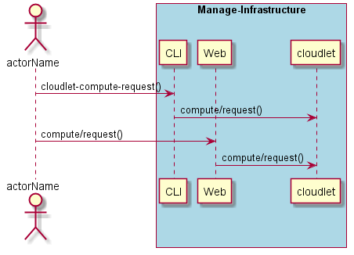
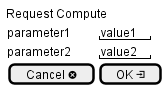

.. _Scenario-Request-Compute:

Request Compute
===============

Request Compute using CLI and Web Interface with ... <parameters>

**CLI**

This is the command line interface for the Request Compute Scenario.

.. code-block:: none

  # cloudlet compute request <parameters>
  # cloudlet compute request exmaple

**Web Interface**

This is a mock up of the Web Interface for the Request Compute Scenario.

**REST**

This is the RESTful interface for the scenario.

*compute/request*

============  ========  ===================
Name          Value     Description
------------  --------  -------------------
parameter1    value1    Description1
============  ========  ===================
