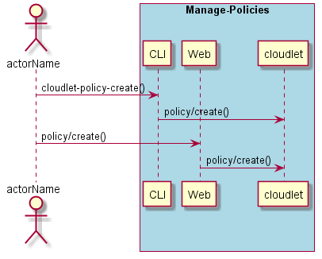

.. _Scenario-Create-Policy:

Create Policy
=============

Create Policy using CLI and Web Interface with ... <parameters>

**CLI**

This is the command line interface for the Create Policy Scenario.

.. code-block:: none

  # cloudlet policy create <parameters>
  # cloudlet policy create exmaple

**Web Interface**

This is a mock up of the Web Interface for the Create Policy Scenario.

**REST**

This is the RESTful interface for the scenario.

*policy/create*

============  ========  ===================
Name          Value     Description
------------  --------  -------------------
parameter1    value1    Description1
============  ========  ===================
