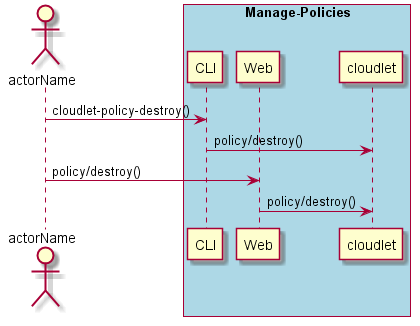

.. _Scenario-Destroy-Policy:

Destroy Policy
==============

Destroy Policy using CLI and Web Interface with ... <parameters>

**CLI**

This is the command line interface for the Destroy Policy Scenario.

.. code-block:: none

  # cloudlet policy destroy <parameters>
  # cloudlet policy destroy exmaple

**Web Interface**

This is a mock up of the Web Interface for the Destroy Policy Scenario.

**REST**

This is the RESTful interface for the scenario.

*policy/destroy*

============  ========  ===================
Name          Value     Description
------------  --------  -------------------
parameter1    value1    Description1
============  ========  ===================
