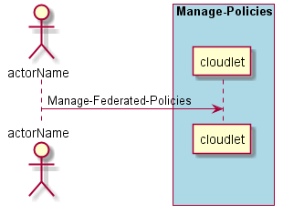
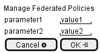

.. _Scenario-Manage-Federated-Policies:

Manage Federated Policies
=========================

Manage Federated Policies using CLI and Web Interface with ... <parameters>

**CLI**

This is the command line interface for the Manage Federated Policies Scenario.

.. code-block:: none

  # cloudlet federated manage <parameters>
  # cloudlet federated manage exmaple

**Web Interface**

This is a mock up of the Web Interface for the Manage Federated Policies Scenario.

**REST**

This is the RESTful interface for the scenario.

*federated/manage*

============  ========  ===================
Name          Value     Description
------------  --------  -------------------
parameter1    value1    Description1
============  ========  ===================
