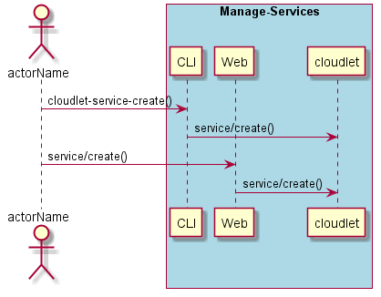
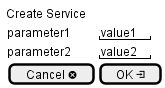

.. _Scenario-Create-Service:

Create Service
==============

Create Service using CLI and Web Interface with ... <parameters>

**CLI**

This is the command line interface for the Create Service Scenario.

.. code-block:: none

  # cloudlet service create <parameters>
  # cloudlet service create exmaple

**Web Interface**

This is a mock up of the Web Interface for the Create Service Scenario.

**REST**

This is the RESTful interface for the scenario.

*service/create*

============  ========  ===================
Name          Value     Description
------------  --------  -------------------
parameter1    value1    Description1
============  ========  ===================
