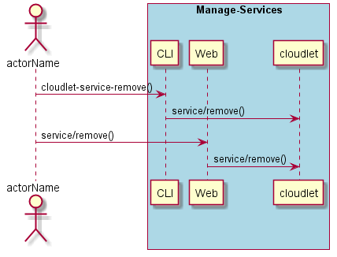
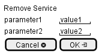

.. _Scenario-Remove-Service:

Remove Service
==============

Remove Service using CLI and Web Interface with ... <parameters>

**CLI**

This is the command line interface for the Remove Service Scenario.

.. code-block:: none

  # cloudlet service remove <parameters>
  # cloudlet service remove exmaple

**Web Interface**

This is a mock up of the Web Interface for the Remove Service Scenario.

**REST**

This is the RESTful interface for the scenario.

*service/remove*

============  ========  ===================
Name          Value     Description
------------  --------  -------------------
parameter1    value1    Description1
============  ========  ===================
